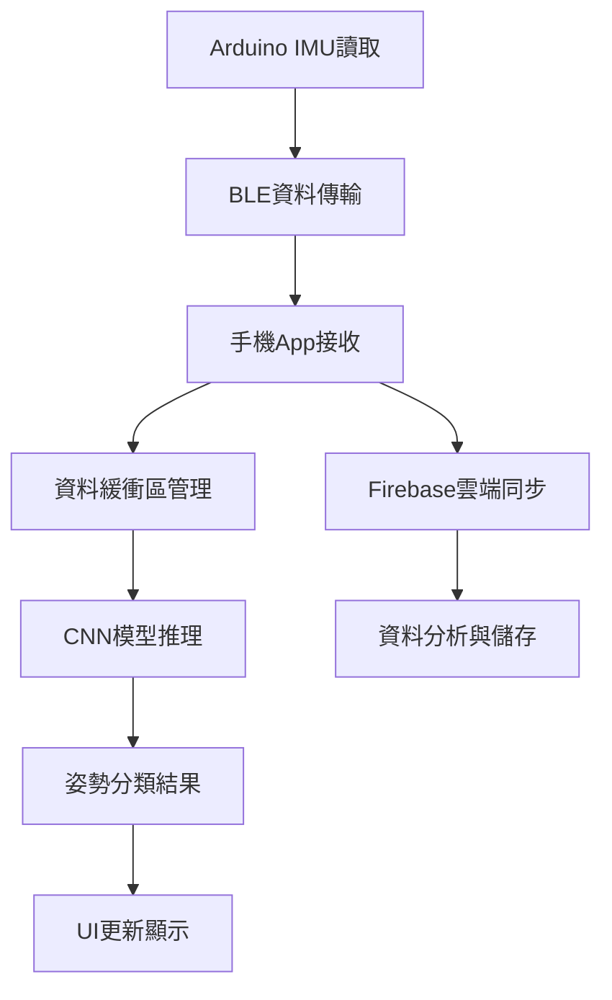

# 🏸 Arduino智能羽毛球拍感測器專案

## 📋 專案概述

本專案是一個基於Arduino的智能羽毛球拍感測器系統，能夠即時偵測和分類羽球擊球動作（發球、殺球、其他），並透過藍牙將資料傳送到手機App進行即時分析和雲端儲存。專案整合了硬體設計、嵌入式程式設計、手機App開發、機器學習和雲端技術。

## 🎯 專案目標

- 開發一個整合在羽毛球拍手柄內的感測器系統
- 即時偵測和分類羽球擊球動作（drive、smash、other）
- 透過藍牙將感測資料傳送到手機App
- 使用AI模型進行即時姿勢識別
- 將資料同步到雲端進行分析

## 🔧 硬體設計

### 核心組件

| 組件 | 型號 | 尺寸 | 功能 |
|------|------|------|------|
| 主控板 | Seeed XIAO nRF52840 Sense | 20×17.5×5 mm | 主控制器，支援BLE |
| 感測器 | LSM6DS3TR | - | 六軸IMU（加速度計+陀螺儀） |
| 電池 | 501230 | - | 3.7V 鋰電池，150mAh |
| 充電接口 | Type-C | 5×8.5×3.5 mm | 充電接口 |

### 硬體配置特點

- **球拍手柄整合設計**: 將所有組件整合到球拍手柄內部，保持原有握感
- **智能充電管理**: 根據電壓自動切換高低電流充電模式（切換點：3.5V）
- **電壓監控**: 每10秒讀取一次電池電壓（每次讀取30筆取平均），低電量時（<3.2V）進入省電模式
- **電池規格**: 501230, 3.7V, 150mAh，正常工作電壓範圍 3.2V ~ 4.2V
- **I²C高速傳輸**: 設定400kHz傳輸速率，確保資料即時性
- **電壓讀取優化**: 降低讀取頻率以節省功耗，使用平均值提高讀數穩定性

### 電路設計

```
球拍手柄內部配置：
● 黑色：Type-C接口 (5×8.5×3.5 mm)
● 綠色：原手柄開孔 (35×12×12 mm)
● 灰色：電池 (20×20×3 mm)
● 黃色：主控板 (20×17.5×5 mm)
● 橙色：手柄
```

## 💻 Arduino程式設計

### 開發環境設定

- **開發板**: Studio XIAO nRF52840 Sense
- **配置**: Seeed nRF52 mbed-enabled Boards (v2.9.3)
- **函式庫**:
  - ArduinoBLE (v1.4.0)
  - Seeed Arduino LSM6DS3 (v2.0.4)

### IMU參數設定

| 參數 | 加速度計 | 陀螺儀 |
|------|----------|--------|
| 資料輸出頻率(ODR) | 416Hz | 416Hz |
| 量測範圍 | ±16G | ±2000 dps |
| 帶寬設定 | 100Hz | 400Hz |
| I²C傳輸速率 | 400kHz | 400kHz |

### 資料格式

- **傳輸頻率**: 每20ms傳送一次
- **單筆資料大小**: 30 bytes
- **資料內容**:
  - timestamp（時間戳）: 4 bytes
  - aX, aY, aZ（加速度三軸）: 各4 bytes
  - gX, gY, gZ（角速度三軸）: 各4 bytes
  - rawVoltage（電壓讀值）: 2 bytes

### BLE設定

- **裝置名稱**: SmartRacket
- **Service UUID**: 0769bb8e-b496-4fdd-b53b-87462ff423d0
- **Characteristic UUID**: 8ee82f5b-76c7-4170-8f49-fff786257090

### 核心功能實作

#### 1. IMU自動校正
```cpp
void calibrateIMUOffsets() {
  // 收集100筆資料計算偏移值
  // 加速度計Z軸減去重力g
  // 陀螺儀各軸計算平均值作為偏移
}
```

#### 2. 智能充電管理
```cpp
void updateChargingMode(float batteryVoltage) {
  // 電池規格：501230, 3.7V, 150mAh
  // 低於3.5V：高電流充電（快速充電）
  // 高於3.5V：低電流充電（保護電池）
  if (batteryVoltage < 3.5) {
    digitalWrite(P0_13, LOW);  // 高電流充電
  } else {
    digitalWrite(P0_13, HIGH); // 低電流充電
  }
}
```

#### 3. 省電模式與電壓監控
```cpp
// 電壓讀取函數（讀取30筆取平均）
int16_t readVoltageAverage() {
  // 啟用分壓電路（P0.14 = LOW）
  // 讀取30筆電壓值並計算平均值
  // 關閉分壓電路以省電（P0.14 = HIGH）
  // 返回12-bit等效電壓原始值
}

void checkVoltageAndSleep() {
  // 電池規格：501230, 3.7V, 150mAh
  // 每10秒讀取一次電壓（降低功耗）
  // 每次讀取30筆取平均（提高穩定性）
  // 電壓<3.2V時進入睡眠模式（低電量警告）
  // 低電量時通知手機並斷線
}
```

## 📱 手機App開發

### 技術棧

- **框架**: Flutter 3.29.3
- **Dart版本**: 3.7.2
- **Android SDK**: API Level 35
- **主要套件**:
  - `flutter_blue_plus`: 藍牙連接
  - `firebase_core`, `firebase_database`, `cloud_firestore`: 雲端資料庫
  - `fl_chart`: 圖表顯示
  - `tflite_flutter`: TensorFlow Lite模型

### 主要功能

#### 1. BLE連線管理
- 自動掃描SmartRacket設備
- 設備名稱優先排序
- 連線狀態監控

#### 2. 即時資料顯示
- 六軸感測器資料的即時波形圖
- 資料緩衝區管理
- 視覺化資料呈現

#### 3. AI姿勢識別
- 40筆資料滑動窗口分析
- 即時CNN模型推理
- 姿勢分類結果顯示（drive、smash、other）
- 結果凍結3秒顯示

#### 4. 雲端資料同步
- Firebase Firestore資料上傳
- 資料結構化管理
- 離線資料緩存

### App架構

```
lib/
├── pages/
│   └── ble_scan_page.dart          # BLE掃描頁面
├── components/
│   ├── ble_data_manager.dart       # BLE資料管理
│   ├── ble_data_receiver_page.dart # 資料接收頁面
│   ├── line_page.dart              # 圖表顯示頁面
│   └── ble_data_posture.dart       # 姿勢識別頁面
└── assets/
    └── badminton_model.tflite      # AI模型檔案
```

## 🤖 AI模型設計

### 模型架構

```python
# CNN模型結構
model = models.Sequential([
    layers.Conv2D(16, (2, 2), activation='relu', input_shape=(40, 6, 1)),
    layers.BatchNormalization(),
    layers.Dropout(0.2),
    layers.Conv2D(32, (2, 2), activation='relu'),
    layers.Dropout(0.1),
    layers.Flatten(),
    layers.Dense(64, activation='relu', kernel_regularizer=regularizers.l2(0.01)),
    layers.Dense(3, activation='softmax')  # 3分類輸出
])
```

### 資料處理流程

1. **資料收集**: 透過Excel記錄標記的IMU資料
2. **Frame切割**: 每40筆資料為一個分析窗口
3. **資料平衡**: 每類別2000個frame，使用過採樣/下採樣
4. **模型訓練**: 50 epochs，80/20訓練驗證分割
5. **模型部署**: 轉換為TFLite格式供手機使用

### 模型參數

- **輸入格式**: [1, 40, 6, 1] (批次大小, 時間點, 特徵, 通道)
- **特徵**: aX, aY, aZ, gX, gY, gZ
- **輸出**: 3分類機率 (drive, other, smash)
- **優化器**: Adam
- **損失函數**: categorical_crossentropy
- **批次大小**: 64

## 📊 資料標記與處理

### 標記策略

- **參考軸**: 使用gY軸作為主要判斷依據
- **峰值偵測**: 透過標準差計算突增值
- **時間窗口**: 峰值前19筆+峰值+後20筆=40筆資料
- **類別標記**: smash、drive、other三類

### 資料品質控制

- 移除時間間隔不在10-40ms的資料段
- 視覺化確認標記結果
- 隨機過採樣平衡類別分布

### 標記工具

- `mark_label_by_time_new.py`: 資料標記程式
- `create_img_to_word.py`: 輸出圖檔程式

## 🔄 系統整合流程



## 📁 專案結構

```
DIID_TermProject/
├── README.md                           # 專案說明文件
├── DIID_TermProject.code-workspace     # VS Code工作區設定
├── src/
│   └── main/
│       └── main.ino                    # Arduino主程式
├── examples/
│   └── Past_Student_Projects/
│       ├── codes/
│       │   ├── Arduino/
│       │   │   └── IMU_Capture_BLE_v9/
│       │   │       └── IMU_Capture_BLE_v9.ino  # 完整Arduino程式
│       │   ├── APP/
│       │   │   └── iot_imu_ble-main.zip        # Flutter App原始碼
│       │   ├── Data_Label/
│       │   │   ├── mark_label_by_time_new.py   # 資料標記程式
│       │   │   └── create_img_to_word.py       # 圖檔輸出程式
│       │   └── Model/
│       │       ├── badminton_model.tflite      # 訓練好的AI模型
│       │       └── train_badminton_model.py    # 模型訓練程式
│       ├── data_full/
│       │   └── *.xlsx                          # 訓練資料集
│       └── 成大IoT羽毛球拍專案報告-第二組.docx  # 專案報告
└── docs/                                 # 文件目錄
```

## 🚀 快速開始

### 1. 硬體準備

1. 準備Seeed XIAO nRF52840 Sense開發板
2. 準備 501230 鋰電池 (3.7V, 150mAh)
3. 準備羽毛球拍（需要加工手柄）
4. 準備Type-C充電線

### 2. Arduino環境設定

1. 安裝Arduino IDE
2. 安裝Seeed nRF52 mbed-enabled Boards (v2.9.3)
3. 安裝必要函式庫：
   - ArduinoBLE (v1.4.0)
   - Seeed Arduino LSM6DS3 (v2.0.4)

### 3. 程式上傳

1. 開啟`src/main/main.ino`
2. 選擇正確的開發板和端口
3. 上傳程式到開發板

### 4. 手機App設定

1. 安裝Flutter開發環境
2. 下載並解壓縮`examples/Past_Student_Projects/codes/APP/iot_imu_ble-main.zip`
3. 設定Firebase專案
4. 將`badminton_model.tflite`放入assets資料夾
5. 編譯並安裝到手機

### 5. 使用方式

1. 開啟手機App
2. 掃描並連接SmartRacket設備
3. 開始擊球，App會即時顯示姿勢分類結果
4. 資料會自動同步到Firebase雲端

## 🔧 技術規格

### 硬體規格

- **處理器**: nRF52840 (ARM Cortex-M4F)
- **記憶體**: 256KB Flash, 32KB RAM
- **感測器**: LSM6DS3TR 六軸IMU
- **通訊**: Bluetooth 5.0
- **電源**: 501230 3.7V 鋰電池，150mAh
- **充電**: Type-C接口

### 軟體規格

- **Arduino版本**: 1.8.19+
- **Flutter版本**: 3.29.3
- **Android API**: 35
- **Firebase**: Cloud Firestore
- **AI模型**: TensorFlow Lite

## 📈 專案成果

### 功能特色

1. **硬體整合**: 無縫整合到球拍手柄，不影響使用體驗
2. **即時性**: 20ms資料更新頻率，滿足即時分析需求
3. **AI準確性**: CNN模型專門針對IMU資料優化
4. **用戶體驗**: Flutter App提供直觀的資料視覺化
5. **雲端整合**: Firebase提供完整的資料管理方案

### 技術亮點

- 智能充電管理系統
- 自動IMU校正功能
- 即時AI姿勢識別
- 雲端資料同步
- 省電模式設計
- 電壓讀取優化（降低頻率，提高穩定性）
- 雙層電壓濾波器（移動平均 + EMA）
- 六軸即時曲線圖顯示（MPAndroidChart）

## 🛠️ 故障排除

### 常見問題

1. **BLE連線失敗**
   - 檢查設備名稱是否為"SmartRacket"
   - 確認手機藍牙已開啟
   - 重新啟動App

2. **資料傳輸不穩定**
   - 檢查Arduino程式是否正確上傳
   - 確認IMU感測器連接正常
   - 檢查電池電量

3. **AI模型無法載入**
   - 確認`badminton_model.tflite`檔案存在
   - 檢查Flutter專案設定
   - 重新編譯App

## 📚 參考資料

- [Seeed XIAO nRF52840 Sense官方文件](https://wiki.seeedstudio.com/XIAO_BLE/)
- [ArduinoBLE函式庫文件](https://www.arduino.cc/reference/en/libraries/arduinoble/)
- [Flutter官方文件](https://flutter.dev/docs)
- [TensorFlow Lite文件](https://www.tensorflow.org/lite)

## 👥 專案團隊

- **硬體設計**: 歐育成、楊梓暄
- **Arduino程式**: 許少麒
- **手機App開發**: 李東霖、許少麒
- **AI模型設計**: 楊梓暄、許少麒
- **資料標記**: 楊梓暄

## 📄 授權

本專案僅供學習參考使用。

---

**注意**: 本專案為學習用途，請確保在實際使用時遵循相關安全規範。
